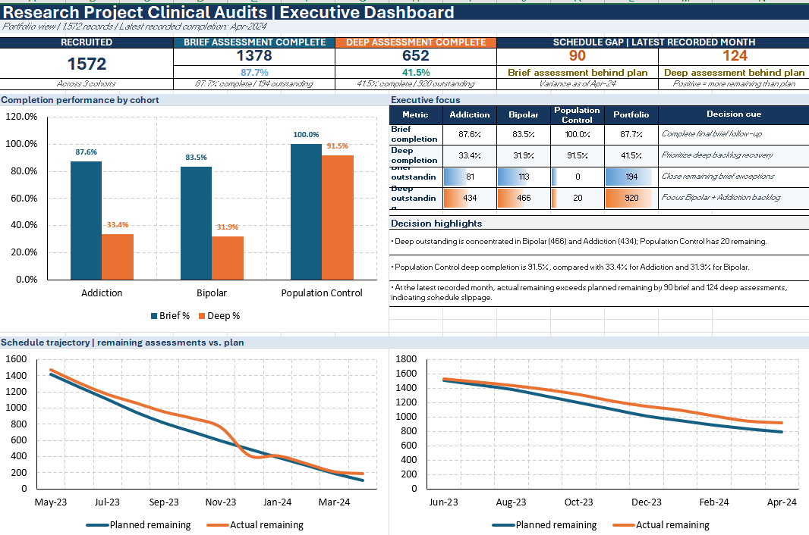

# Excel Research Project Executive Dashboard

An Excel portfolio project demonstrating **executive reporting, KPI tracking, cohort analysis, backlog monitoring, and plan-versus-actual progress reporting** using synthetic research-project data.

> **Portfolio note:** All records, IDs, cohort labels, and operational information in this project are synthetic and were created solely for portfolio demonstration purposes. No real participant, patient, employee, or confidential organizational information is included.

---

## Dashboard Preview



---

## Project Overview

This project demonstrates how a detailed operational dataset can be transformed into a concise **executive dashboard** that helps leadership monitor progress, identify backlog, compare performance across cohorts, and assess whether work is progressing according to plan.

The workbook contains **1,572 synthetic assessment records across three research cohorts**:

- Addiction
- Bipolar
- Population Control

The dashboard is designed to answer four management questions:

1. How large is the current workload?
2. How much work has been completed?
3. Where is the outstanding workload concentrated?
4. Are actual completions keeping pace with the planned schedule?

---

## Key Executive KPIs

| KPI | Result |
|---|---:|
| Total Records / Recruited | 1,572 |
| Brief Assessments Complete | 1,378 |
| Brief Completion Rate | 87.7% |
| Brief Assessments Outstanding | 194 |
| Deep Assessments Complete | 652 |
| Deep Completion Rate | 41.5% |
| Deep Assessments Outstanding | 920 |
| Latest Recorded Month | April 2024 |
| Brief Schedule Gap | +90 |
| Deep Schedule Gap | +124 |

> A positive schedule gap indicates that more assessments remain than planned at the same point in time.

---

## Dashboard Sections

### 1. Portfolio KPI Band

Provides an immediate executive view of:

- Total recruited / tracked records
- Brief completion
- Deep completion
- Current schedule variance
- Latest reporting period

This allows leadership to understand overall portfolio status without reviewing the detailed source data.

### 2. Completion Performance by Cohort

Compares **Brief** and **Deep** completion rates across:

- Addiction
- Bipolar
- Population Control

This view helps identify which cohorts are progressing well and which may require additional follow-up or workload attention.

### 3. Executive Focus

Summarizes cohort-level:

- Completion rates
- Outstanding Brief assessments
- Outstanding Deep assessments
- Decision cues
- Management highlights

The purpose of this section is to move beyond reporting numbers and make areas requiring attention easier to identify.

### 4. Schedule Trajectory

Two burndown-style charts compare:

**Planned Remaining Assessments vs. Actual Remaining Assessments**

for both Brief and Deep assessments.

These charts help leadership determine whether the project is progressing according to the expected schedule and where backlog recovery may be required.

---

## Workbook Structure

The Excel workbook contains only the sheets required to support the dashboard.

### `Dashboard`

Executive-level reporting view containing:

- KPI cards
- Cohort completion comparison
- Executive-focus table
- Decision highlights
- Brief schedule trajectory
- Deep schedule trajectory

### `Research Data`

Contains the synthetic record-level data required to calculate the dashboard metrics.

Key fields include:

- Research Project ID
- Assessment ID
- Cohort
- Brief Assessment Status
- Deep Assessment Status
- Planned dates
- Completion dates

Sequential synthetic IDs are used instead of real participant identifiers.

### `README`

Documents:

- Project purpose
- KPI definitions
- Dashboard interpretation
- Data maintenance practices
- Data quality controls
- Confidentiality and public-sharing considerations

---

## Excel Skills Demonstrated

This project demonstrates practical use of:

- `COUNTIF`
- `COUNTIFS`
- `IFERROR`
- `TEXT`
- Percentage calculations
- Date-based calculations
- Cross-sheet references
- KPI development
- Cohort-level analysis
- Outstanding-work calculations
- Plan-versus-actual reporting
- Burndown / schedule trajectory charts
- Executive dashboard layout and organization

---

## Business / Administrative Relevance

This project demonstrates how Excel can support administrative, program, research, and operational reporting responsibilities.

The workbook shows the ability to:

- Maintain a high-volume structured dataset
- Monitor completion and outstanding work
- Track progress across multiple workstreams
- Identify areas requiring follow-up
- Compare actual progress against planned timelines
- Calculate and communicate backlog
- Highlight exceptions and management priorities
- Convert detailed operational records into concise executive reporting
- Present information in a format designed for leadership decision-making

---

## Data Quality & Maintenance Approach

For consistent reporting, the underlying dataset should be maintained using standardized practices:

1. Assign a unique ID to every record.
2. Use standardized cohort and status values.
3. Store dates as true Excel dates rather than text.
4. Avoid manually entering summary totals in the dashboard.
5. Calculate dashboard metrics directly from the underlying records.
6. Update completion dates promptly when work is completed.
7. Review missing or inconsistent status/date combinations before reporting.
8. Reconcile dashboard totals with source-data counts after major updates.
9. Keep detailed operational data separate from executive-level reporting.
10. Document KPI definitions so future users interpret metrics consistently.

---

## Data Privacy & Confidentiality

All data in this repository is **synthetic**.

If a similar dashboard were used with real research, healthcare, client, or organizational information, appropriate controls would include:

- Restricted access based on role
- Least-privilege permissions
- Approved organizational storage
- Separation or masking of direct identifiers
- Use of aggregate reporting where detailed records are not required
- Controlled sharing of research or participant information
- Regular review of access permissions
- No confidential information, passwords, credentials, or access tokens stored in a public GitHub repository

This public portfolio version intentionally uses sequential synthetic IDs and contains only the data fields required to support the dashboard.

---

## Download the Excel Workbook

➡️ **[Download the Research Project Executive Dashboard](research-project-clinical-audits-dashboard.xlsx)**

For the best viewing experience, download the workbook and open it in **Microsoft Excel desktop**, as GitHub does not provide a full interactive preview of Excel dashboards and charts.

---

## Repository Contents

```text
excel-research-project-dashboard/
│
├── README.md
├── research-project-clinical-audits-dashboard.xlsx
└── 02-research-project-dashboard.png
```

---

## Portfolio Focus

This project highlights my ability to use Excel for:

**Data Maintenance → KPI Tracking → Progress Monitoring → Executive Decision Support**

It demonstrates how detailed operational records can be translated into a clear management view that supports prioritization, follow-up, and schedule oversight.

